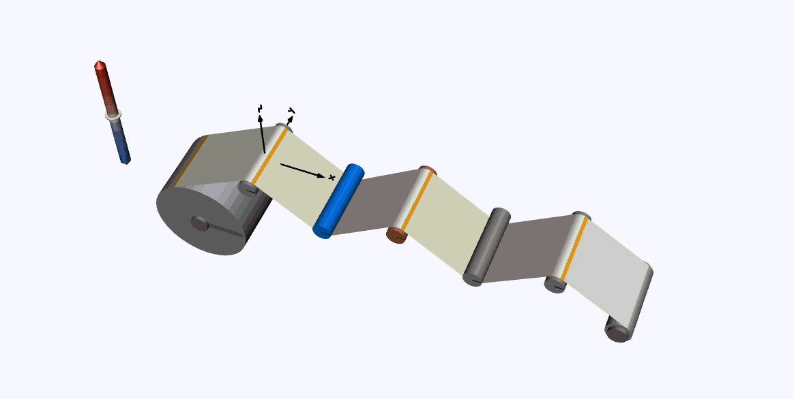

# Roll2RollDynamics

A Modelica library for roll-to-roll web handling: tension, traction, winding,
pressure nips and lateral tracking in converting lines, printing presses,
coaters, calenders and belt drives.



Worked examples with results and discussion are on
[nouseng.co/libraries](https://www.nouseng.co/libraries/):
[misaligned idler](https://www.nouseng.co/examples/misaligned-idler/),
[nip loading](https://www.nouseng.co/examples/nip-loading/) and
[retracting idler](https://www.nouseng.co/examples/retracting-idler/).

## What it models

- Rollers, wound rolls, free web spans, pressure nips and prescribed web
  loads, parameterized by material properties, roll geometry, bearing drag and
  friction.
- Web routes solved from connected roll positions and radii: tangency points,
  span lengths and wrap angles follow from the geometry.
- Material conservation in every span, wrap and winder, with elastic stretch,
  Kelvin-Voigt damping and longitudinal inertia setting tension.
- Roll yaw and tram, drum runout and crossed or wedged nips, with a lateral
  steering model for fixed yaw.

The library has its own web and nip connectors and uses Modelica Standard
Library (MSL) components for drives, joints and controllers. The
`Validation` page in the library lists what each effect has been checked
against and what it has not.

## Requirements

- OpenModelica 1.27.0, the version the library is checked with.
- Modelica Standard Library 4.1.0.

The release review environment is Windows. Linux and macOS have not been
verified.

## Installation

1. Install OpenModelica and the Modelica Standard Library 4.1.0.
2. Clone the repository and change into this folder:

   ```sh
   git clone https://github.com/nouseng/libraries.git
   cd libraries/Roll2RollDynamics
   ```

3. In OMEdit, open `Roll2RollDynamics/package.mo`. From the command line:

   ```modelica
   loadModel(Modelica, {"4.1.0"});
   loadFile("Roll2RollDynamics/package.mo");
   ```

## Getting started

Open `Roll2RollDynamics.Introduction` for an overview, then
`Roll2RollDynamics.GettingStarted` for a guided setup of a complete line.
`Roll2RollDynamics.Examples.WebLines.MisalignedIdlerLine` is the model that
walkthrough follows. A line needs one `inner Roll2RollDynamics.WebWorld world`
at the top level.

## Folder layout

| Folder | Contents |
| --- | --- |
| `Roll2RollDynamics/` | The library |
| `Roll2RollDynamicsTest/` | Test library, runners and verification scripts |

## Tests

From this folder, with OpenModelica on `PATH`:

```powershell
omc Roll2RollDynamicsTest/Resources/Scripts/CheckLibrary.mos
```

This runs the structural checks. Physics suites and the commands for each
change are listed in [Roll2RollDynamicsTest/README.md](Roll2RollDynamicsTest/README.md).

## Limitations

The web must remain taut and roller mount orientations fixed. Spans remain
straight: bending, wrinkling, buckling and distributed wave propagation are not
modelled. Lateral motion has one degree of freedom per roll.

## Licence

Copyright (c) 2026 Vedat Senol. Released under the BSD 3-Clause Licence; see
[LICENSE](LICENSE).

## Citing

If you use the library in published work, please cite:

> Senol, V. (2026). *Roll2RollDynamics: a Modelica library for roll-to-roll
> web handling* (Version 1.0.0) [Computer software].
> https://github.com/nouseng/libraries/tree/main/Roll2RollDynamics

## Consulting and contact

Need a model of your own line, calibration against plant data or a
controller study? Nous Engineering & Research builds and validates web-handling and
machine-dynamics models. Contact Vedat Senol at
[vedat@nouseng.co](mailto:vedat@nouseng.co).
